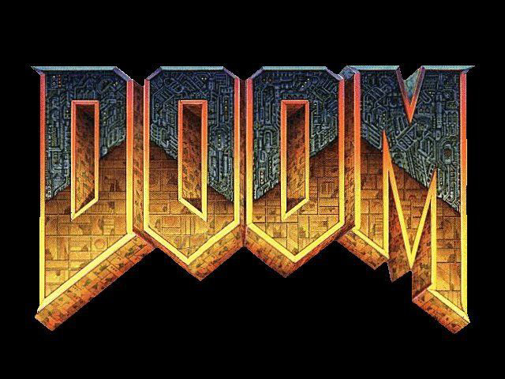

# VizDoom agent

This project is my attempt at implementing a reinforcement agent to play the original Doom video game, using the vizdoom toolkit.
<p align="center">
	
	
</p>

## Usage
You can train the model by executing the following command:
```bash
python Doom_DQN.py
python Doom_PPO.py
```
## Results 
Coming soon

## Environment: doom_defend_center
*The purpose of this scenario is to teach the agent that killing the monsters is GOOD and when monsters kill you is BAD. In addition, wasting amunition is not very good either. Agent is rewarded only for killing monsters so he has to figure out the rest for himself. Map is a large circle. Player is spawned in the exact center. 5 melee-only, monsters are spawned along the wall. Monsters are killed after a single shot. After dying each monster is respawned after some time.Episode ends when the player dies.* - https://deepanshut041.github.io/Reinforcement-Learning/cgames/03_doom_defend_center/


## Bot algorithm
The agent is based on the clip varient of PPO (Proximal Policy Optimization). But i am struggle with the sparse reward problem and as such I might switch to a Q-learning based agent Like vanilla DQN


# Dependencies
- vizdoom
- PyTorch
